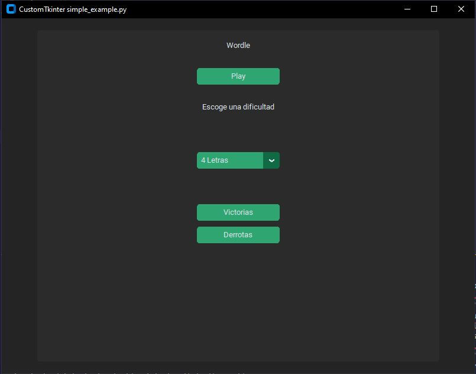
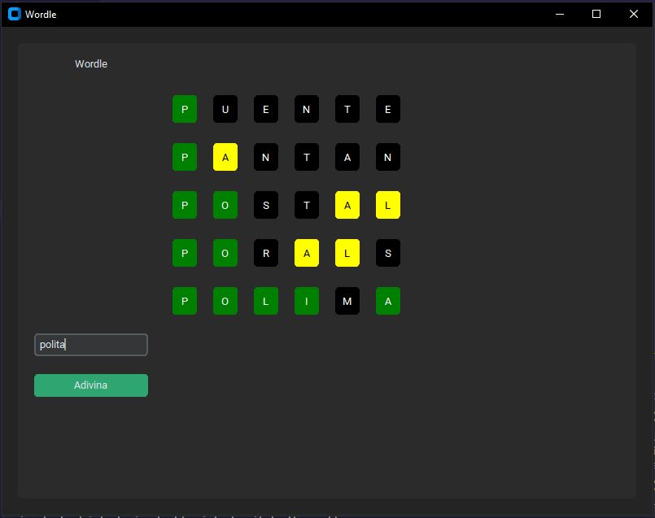

# WORDLE - Assignment #2 for the Data Structures Course at the National University of Colombia, Medellin Campus

## Table of contents

- [Overview](#overview)
  - [The challenge](#the-challenge)
  - [Screenshot](#screenshot)
- [My process](#my-process)
  - [Built with](#built-with)
  - [What I learned](#what-i-learned)
- [Author](#author)
- [Acknowledgments](#acknowledgments)

## Overview

### The challenge

Build the Worlde Game using data structures such as queues, stacks, dynamic array redirection, etc.

- The game must have game modes with 4, 5, 6, 7, and up to 8 words.
- The player will have 6 attempts to guess the word.
- If they have a correct letter in the correct position, the box will light up in green. If the letter is part of the word but not in the right place, the box will light up in yellow.

### Screenshot

## My process

### Built with

- Python 3.10.6
- [Tkinter]([https://docs.python.org/3/library/turtle.html](https://docs.python.org/es/3/library/tkinter.html)) - Python library
- [CustomTkinter 5.2.0]([[https://docs.python.org/3/library/turtle.html](https://docs.python.org/es/3/library/tkinter.html)](https://pypi.org/project/customtkinter/)) - Python library

### What I learned

I learned how efficient it can be to use the right data structure to optimize program execution time. furthermore, I learned a bit more about Tkinter and CustomTkinter to create interfaces.

## Author

- LinkedIn - [Juan Pablo Cuartas](https://www.your-site.com)
- Email - [juanpa88842@gmail.com](https://www.linkedin.com/in/juanpablocuartas/)

## Acknowledgments

I want to thank Victor and Michael for being part of my team during the course.
